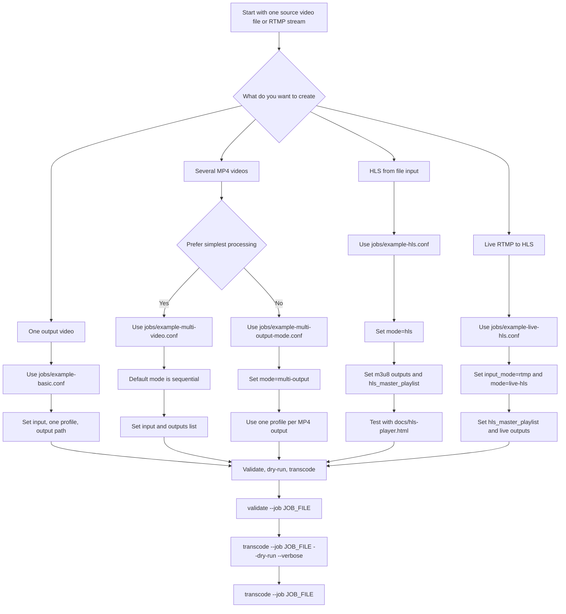

# Workflow guide

Use this guide to choose the right `vtx` job style and the minimum config fields to edit.

## Decision diagram



If this block appears as plain code in your editor preview, the editor does not render Mermaid diagrams by default. GitHub renders Mermaid blocks natively; VS Code may need a Mermaid preview extension.

## Basic single output

Use this when you want one input video converted to one output preset, such as `720p` or `1080p`.

Start from:

```bash
./bin/vtx.sh transcode --job ./jobs/example-basic.conf --dry-run --verbose
```

Job fields to check:

- `input`: source video path
- `ffmpeg`: usually `ffmpeg`
- `overwrite`: `true` or `false`
- `outputs`: one profile file

Profile fields to check:

- `name`: readable output name
- `preset`: preset name such as `720p`, `1080p`, or a custom preset path
- `output`: final MP4 path

## Several MP4 videos, sequential mode

Use this when you want several output videos and prefer the simplest, safest behavior. `vtx` runs one FFmpeg command per profile, one after another.

Start from:

```bash
./bin/vtx.sh transcode --job ./jobs/example-multi-video.conf --dry-run --verbose
```

Job fields to check:

- `input`: source video path
- `outputs`: comma-separated profile files
- `cpu_limit`: optional job-level processing limit such as `50%`

Profile fields to check:

- `preset`: one preset per output video
- `output`: one MP4 path per profile
- optional overrides: `video_bitrate`, `audio_bitrate`, `quality`, `width`, `height`

Choose this mode first unless you specifically need one FFmpeg process.

## Several MP4 videos, multi-output mode

Use this when you want several MP4 outputs from one FFmpeg process. This is useful when you want the source decoded once and split into multiple renditions.

Start from:

```bash
./bin/vtx.sh transcode --job ./jobs/example-multi-output-mode.conf --dry-run --verbose
```

Job fields to check:

- `mode=multi-output`
- `input`: source video path
- `outputs`: comma-separated profile files
- `cpu_limit`: optional job-level processing limit such as `50%`

Profile fields to check:

- `preset`: one preset per output video
- `output`: one MP4 path per profile

Use dry-run first and review the generated `filter_complex` command. Multi-output mode is more efficient for some workflows, but it is less simple than sequential mode.

## HLS streaming output from file input

Use this when you want HLS playlists and segments from a normal source file.

Start from:

```bash
./bin/vtx.sh transcode --job ./jobs/example-hls.conf --dry-run --verbose
```

Job fields to check:

- `mode=hls`
- `input`: source video path
- `hls_master_playlist`: required master playlist path, for example `./out/hls/master.m3u8`
- `hls_segment_time`: optional target segment length, default `6`
- `hls_playlist_type`: optional, usually `vod`
- `hls_flags`: optional, usually `independent_segments`
- `outputs`: comma-separated HLS profile files

Profile fields to check:

- `preset`: one preset per HLS rendition
- `output`: variant playlist path ending with `.m3u8`, for example `./out/hls/720p/index.m3u8`

## Live RTMP to HLS

Use this when OBS or another publisher sends an RTMP stream and you want `vtx` to produce HLS on the fly.

Start from:

```bash
./bin/vtx.sh transcode --job ./jobs/example-live-hls.conf --dry-run --verbose
```

Job fields to check:

- `input_mode=rtmp`
- `input`: RTMP URL such as `rtmp://127.0.0.1:1935/live/browser`
- `input_args`: optional live ingest tuning such as `-fflags nobuffer`
- `mode=live-hls`
- `hls_master_playlist`: required master playlist path
- `hls_segment_time`: default `2`
- `hls_list_size`: default `8`
- `hls_delete_segments`: default `true`
- `hls_append_list`: default `true`
- `outputs`: comma-separated live HLS profile files

Profile fields to check:

- `preset`: one preset per live rendition
- `output`: variant playlist path ending with `.m3u8`

The first live version is RTMP-first and does not include built-in restart supervision or watch mode.

After generating HLS files, test playback with the browser test page:

```bash
python3 -m http.server 8080
```

Open:

```text
http://localhost:8080/docs/hls-player.html?src=/out/hls/master.m3u8
```

## Recommended command flow

For every job, use the same safe command flow:

```bash
./bin/vtx.sh validate --job ./jobs/example-live-hls.conf
./bin/vtx.sh transcode --job ./jobs/example-live-hls.conf --dry-run --verbose
./bin/vtx.sh transcode --job ./jobs/example-live-hls.conf --verbose --log ./logs/live-hls.log
```

`validate` catches config problems. `--dry-run --verbose` lets you inspect the generated FFmpeg command. `--log` saves details for later review.
